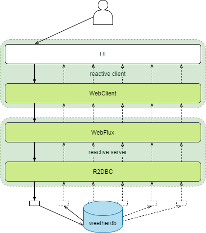
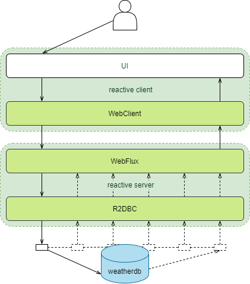

# Реактивные микросервисы в Spring Boot
## Примеры Mono и Flux из Project Reactor
расположены `reactive-server/src/test/java/edu/reactive/example`

## Демонстрационное приложение
Ожидаемый пример работы приложения:



Реальность примера на текущий момент:



## База-данных 
### PostgreSQL в виде Docker файла
расположен `postgresql`
### H2 в виде проекта Spring Boot
расположено `h2-db`
при работе через реактивный драйвер R2DBC возникало множество проблем.

## Реактивный сервер
расположен `reactive-server`
### WebFlux
основной класс
`reactive-server/src/main/java/edu/reactive/server/rest/WeatherRestController.java`
### R2DBC
основной класс
`reactive-server/src/main/java/edu/reactive/server/repository/WeatherDataRepository.java`
## Реактивный клиент
расположен `reactive-client`
### Router
основной класс
`reactive-client/src/main/java/edu/reactive/client/route/WeatherRouter.java`
### WebClient
основной класс
`reactive-client/src/main/java/edu/reactive/client/service/WeatherServiceClient.java`

## Первоначальная настройка БД вручную
При желании инициализацию БД можно перенести в команды docker-compose или liquibase
1. для первоначального запуска выполнить находясь в корне проекта
```bash
cd postresql
docker-compose up --build
```
2. оставить окно терминала запущенным
3. перейти в браузер: http://localhost:8085/
4. использовать 
логин: `postgresql`
пароль: `example`
5. создать БД с названием `weatherdb`
6. если все прошло успешно убедитья, что выбрана weatherdb и перейти в [SQL Command] 
   или перейти по http://localhost:8085/?pgsql=db&username=postgres&db=weatherdb&ns=public&sql=
7. применить скрипт начальной загрузки из файла `postgresql/dataset-01.sql`

## Запуск reactive-server
### Пример запуска с помощью Maven
```bash
# Linux or Mac OS
cd reactive-server
mvnw clean spring-boot:run
# Windows
mvnw.cmd clean spring-boot:run
```

## Запуск reactive-client
### Пример запуска с помощью Maven
```bash
cd reactive-client
# Linux or Mac OS
mvnw clean spring-boot:run
# Windows
mvnw.cmd clean spring-boot:run
```
